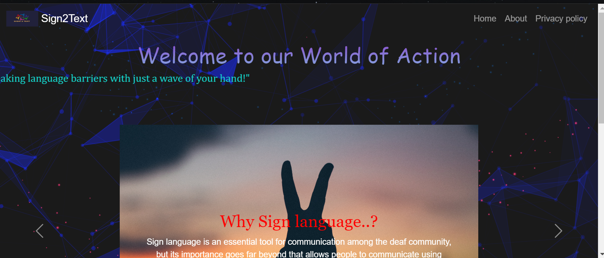
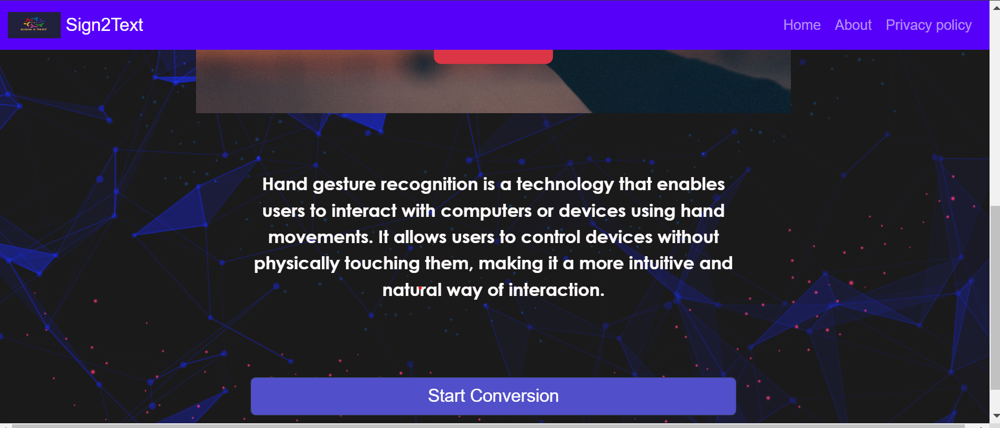
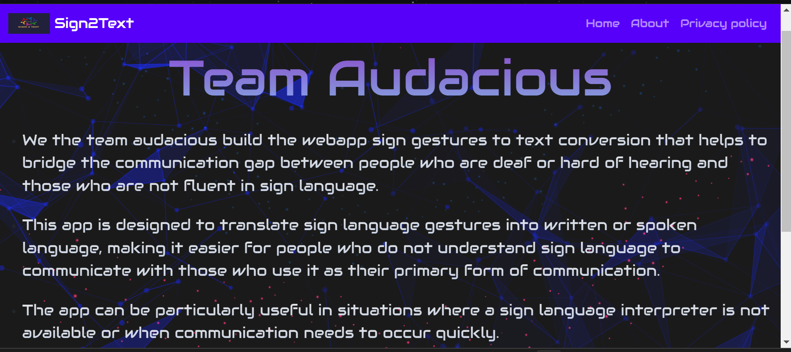
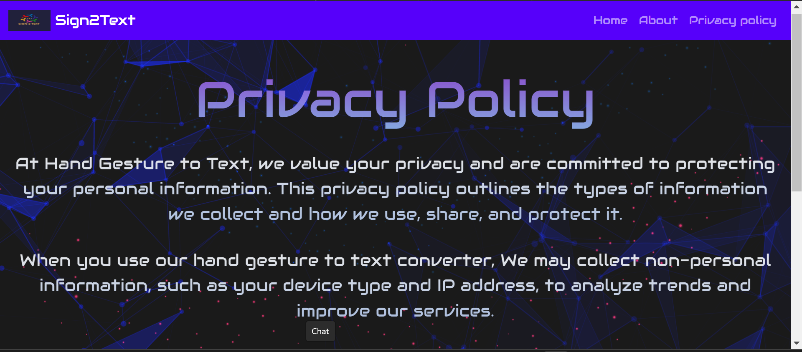
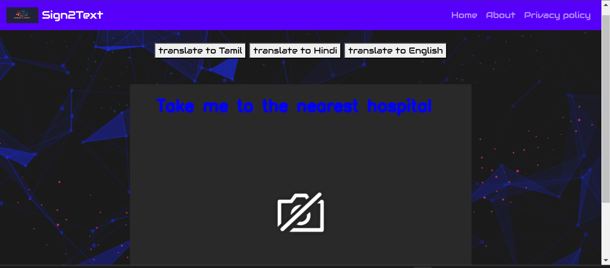
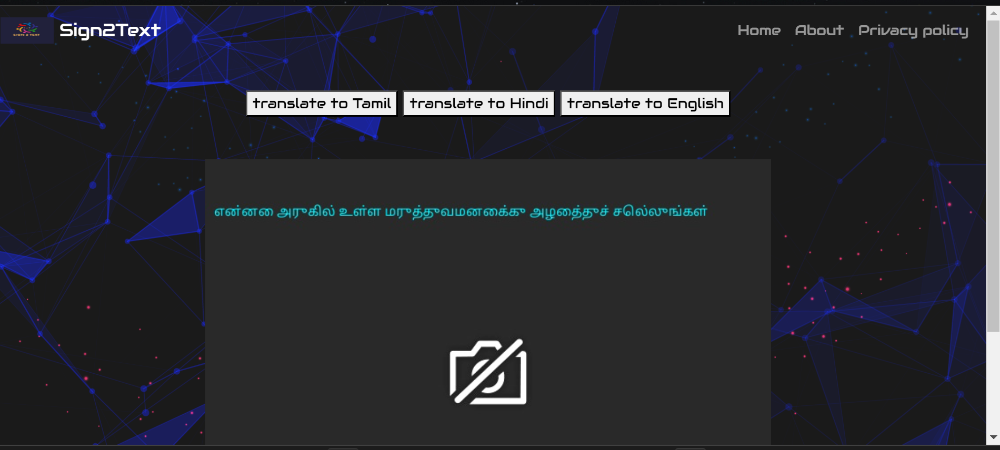
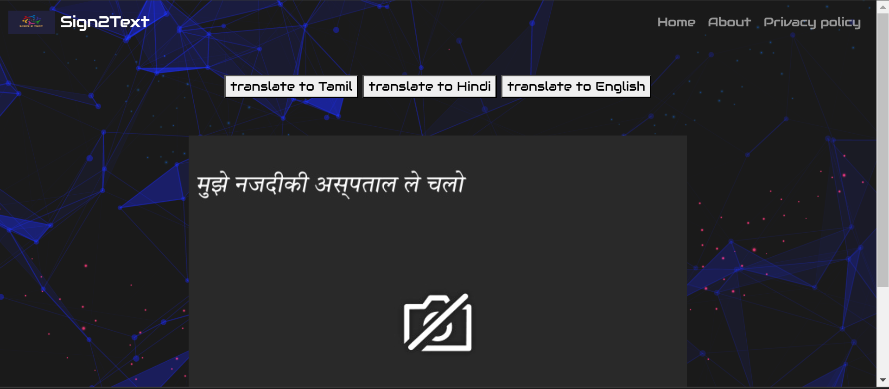
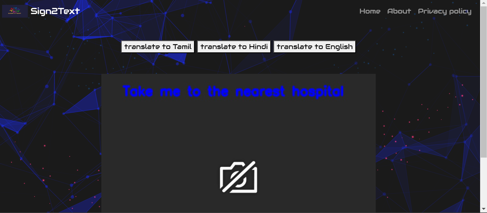

# Sign2Text Web App

The Sign2Text web app is a bold initiative aimed at addressing communication barriers faced by individuals who are deaf or hard-of-hearing. Leveraging the power of engineering excellence, this innovative web application converts sign language gestures into text, facilitating a seamless and inclusive bridge of communication between sign language users and non-sign language users.

## Features

- Live video capture from a webcam using the OpenCV library.
- Hand gesture recognition and translation powered by advanced image processing techniques and the MediaPipe library.
- Preprocessing of captured frames for optimal analysis and feature extraction.
- Extraction of hand landmarks and features to characterize different gestures.
- Gesture recognition utilizing a Support Vector Machine (SVM) classifier trained on a labeled dataset of hand gestures using the scikit-learn library.

## Setup and Usage

To run the Sign2Text web app locally:

1. Clone the repository.
2. Install the required dependencies listed in the `requirements.txt` file.
3. Start the application.
4. Access the web app through the provided URL.
5. Follow the on-screen instructions to perform hand gestures and observe the recognized translations.

## Accuracy and Performance

The Sign2Text web app achieves high accuracy in recognizing hand gestures, providing reliable translations of sign language. Extensive performance optimizations ensure real-time processing and a smooth user experience.
## Pictures 

  
  
  
  
  
  
  
  

## Acknowledgments

We extend our heartfelt appreciation to the developers and contributors of the OpenCV, MediaPipe, and scikit-learn libraries for their invaluable resources and support. 
Additionally, we would like to express our sincere gratitude to our mentor, Dr. Anand R, Associate Professor,
Department of Computer Science & Engineering, KCG College of Technology, for his guidance and expertise throughout the development process. 
We are also thankful to o the Head of the Department Dr. Cloudin S, Department of Computer Science & Engineering, KCG College of Technology,for his continuous support and encouragement. Their valuable insights have been instrumental in shaping the Sign2Text web app into what it is today.

## Team

Sign2Text app was developed by Team Audacious, consisting of the following dedicated members:

- [Sangeetha D](https://github.com/sangeethadhanasekar)
- [Shyamily R](https://github.com/Shyamily240702)
- [Rowan Lourdes J](https://github.com/rowanX14)
- [Nitisri T S](https://github.com/Nitisri06)

Their hard work, passion, and collaborative efforts have been crucial in bringing the Sign2Text web app to life.

## Contributing

Contributions to enhance the Sign2Text web app are most welcome. Please review the contribution guidelines in the repository for more details.

## License

This project is licensed under the [MIT License](LICENSE).

## Contact

For any questions or inquiries, please reach out to [20cs058@kcgcollege.com].

